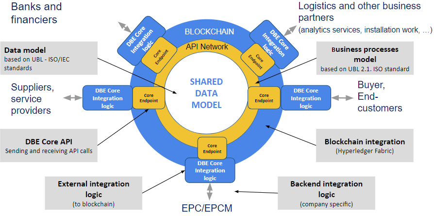

# DBE Core Hyperledger Lab

##### DBE Core Hyperledger Lab is an incubation project of the open source umbrella project [Hyperledger](https://www.hyperledger.org/).

The DBE Core Lab aims to develop a vendor-independent platform for seamless integration of enterprise systems based on [DBE Core APIs](https://dbecore.com/) and Blockchain technologies. The DBE Core APIs employ ISO/IEC-approved data standards to enable electronic transactions among systems of business parties. The project aims to integrate the DBE Core API technology with Hyperledger blockchain technologies such as [Fabric](https://www.hyperledger.org/projects/fabric), to establish consistent, secure, smart-contract and transaction-based inter-system communication with audit trails, as well as traceability between related transactions during product data life-cycle events.

## Scope of the Lab

Transactions are executed through open-source DBE Core APIs (= Core Endpoint in Figure 1). The shared data models and collaborative business processes (= messages for each process) are also used to deliver data to the other potential parties of a data transaction, such as a bank offering trade finance services, a transportation operator offering document handling services, or an engineering, procurement, and construction management (EPCM) service provider.
The DBE Core projects develop the shared data models, the collaborative business processes, and the APIs. All that a company needs to do is to integrate the Core Endpoints into its back-end systems, which could even be its existing Edifact and/or portal system. Similarly, if an ERP system provider integrates its ERP into the Core Endpoints, then all the users of the ERP system are connected to the Core Endpoints (assuming that the ERP system provider offers this solution to all its clients).
The necessary standards and technologies are now available to establish end-to-end digitalization and automation of local and global trade transactions. The fact that most documents used in supply chain processes are already created with information systems (IS) is also important. The purpose of the DBE Core projects can be regarded as replacing the current manual “IS-to-paper” –> “paper-to-IS” processes with  automated and integrated processes.

Figure 1. DBE Core concept from a higher-level business perspective

In summary, the DBE Core projects develop standardized APIs to accelerate the digitalization of domestic and global trade. Open-source DBE Core APIs offer interoperability in the end-to-end digitalization of sourcing, procurement, logistic, and trade financing processes. These APIs are integrated into the Hyperledger Services to record trade transactions. The combination of DBE Core APIs and Hyperledger is used to facilitate the development of innovative transaction security services, financing services (e.g., “order book” financing), and product data monitoring services. Transaction recording in Hyperledger also offers the potential of using artificial intelligence to further analyze supply chain data.
